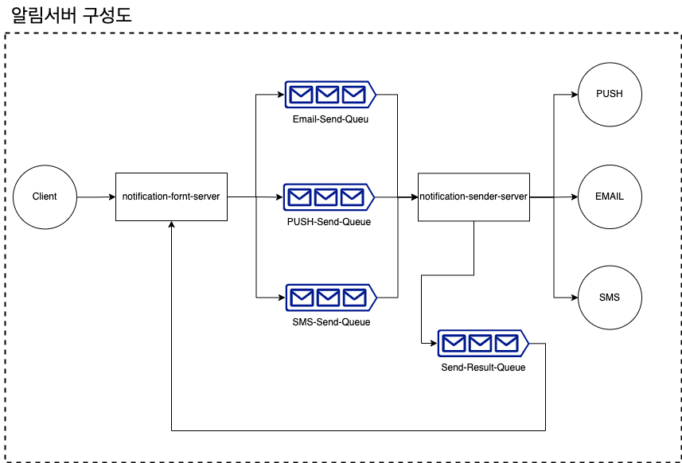

# 알림 서버

## 알림 서버 구조



알림 front 서버와 알림 전송 서버로 구성
* notification-front-server : 클라이언트의 발송요청 받고 내역을 관리하며, 알림 발송서버로 중개하는 역할 
* notification-front-server : 실제 발송채널로 메시지를 전송하는 역할
* 알림 정보를 알림 발송서버로 전달할 때 RabbitMQ 를 통하여 전달 한다.

## docker RabbitMQ 설치

```
docker pull rabbitmq
```

* rabbitmq_management enable

```
docker exec rabbitmq rabbitmq-plugins enable rabbitmq_management
```

* rabbitmq 실행
```
docker run -d -p 15672:15672 -p 5672:5672 --name rabbitmq rabbitmq
```

