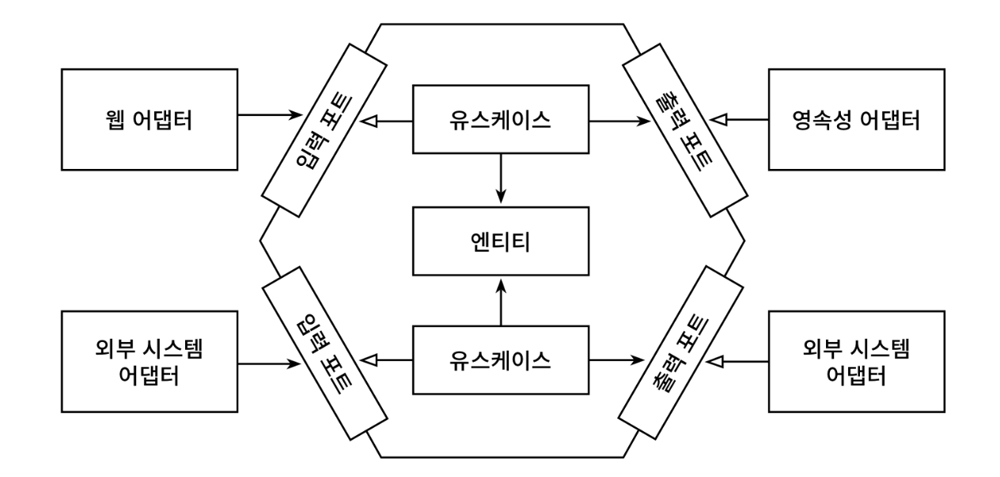

# 1. 디렉토리 구조

---

핵사고날 아키텍처의 Port And Adapter 패턴을 이용하여 구성



```tree
nfs
├── NotificationFrontServerApplication.java
├── common
│   ├── PayloadConvertException.java
│   ├── Serializer.java
│   └── config
│       ├── NotificationConfig.java
│       └── SwaggerConfig.java
└── notification
    ├── adapter
    │   ├── in
    │   │   └── web
    │   │       ├── GetNotificationSendQueryController.java
    │   │       ├── RegisterForEmailSendController.java
    │   │       ├── RegisterForPushSendController.java
    │   │       ├── RegisterForSMSSendController.java
    │   │       └── dto
    │   │           ├── NotificationSendQueryResponse.java
    │   │           ├── PageMaker.java
    │   │           ├── QueryParam.java
    │   │           ├── RegisterForNotificationSendRequest.java
    │   │           └── RegisterForNotificationSendResponse.java
    │   └── out
    │       ├── handler
    │       │   ├── SendNotificationHandler.java
    │       │   └── StartNotificationEventHandler.java
    │       ├── infra
    │       │   ├── event
    │       │   │   ├── EventSerializer.java
    │       │   │   └── NotificationEventPublisher.java
    │       │   ├── rabbitmq
    │       │   │   ├── NotificationConsumer.java
    │       │   │   ├── RabbitMQConfig.java
    │       │   │   ├── SendNotificationProducer.java
    │       │   │   └── dto
    │       │   │       ├── EmailMessage.java
    │       │   │       ├── MessageMapper.java
    │       │   │       ├── PushMessage.java
    │       │   │       ├── ResultMessage.java
    │       │   │       └── SMSMessage.java
    │       │   └── schedule
    │       │       ├── DeleteNotificationSchedule.java
    │       │       └── NotificationEventSchedule.java
    │       └── persistence
    │           ├── event
    │           │   ├── EventStoreAdapter.java
    │           │   ├── NotFoundNotificationEventException.java
    │           │   ├── NotificationEventMapper.java
    │           │   ├── NotificationEventRepository.java
    │           │   └── entity
    │           │       ├── EventType.java
    │           │       ├── NotificationEventEntity.java
    │           │       └── State.java
    │           └── notification
    │               ├── NotificationMapper.java
    │               ├── NotificationPersistenceAdapter.java
    │               ├── entity
    │               │   ├── Channel.java
    │               │   └── NotificationEntity.java
    │               └── repository
    │                   └── NotificationRepository.java
    ├── application
    │   ├── port
    │   │   ├── in
    │   │   │   ├── RegisterForEmailSendUseCase.java
    │   │   │   ├── RegisterForPushSendUseCase.java
    │   │   │   ├── RegisterForSMSSendUseCase.java
    │   │   │   ├── ResultNotificationUseCase.java
    │   │   │   ├── SendNotificationUseCase.java
    │   │   │   └── command
    │   │   │       ├── RegisterForEmailSendCommand.java
    │   │   │       ├── RegisterForNotificationSendCommand.java
    │   │   │       ├── RegisterForPushSendCommand.java
    │   │   │       ├── RegisterForSMSSendCommand.java
    │   │   │       └── SendNotificationCommand.java
    │   │   └── out
    │   │       ├── EventNotificationPort.java
    │   │       ├── GetNotificationQueryPort.java
    │   │       ├── InsertNotificationPort.java
    │   │       ├── NotificationEventPort.java
    │   │       ├── SendNotificationClientPort.java
    │   │       └── UpdateNotificationStatePort.java
    │   └── service
    │       ├── RegisterForNotificationService.java
    │       ├── SendNotificationService.java
    │       └── exception
    │           ├── AlreadySendNotifiedException.java
    │           ├── SendNotificationFailException.java
    │           └── SendNotificationTimeoutException.java
    ├── domain
    │   ├── Channel.java
    │   ├── Client.java
    │   ├── Contents.java
    │   ├── CreateDt.java
    │   ├── DeliveryReqDtm.java
    │   ├── EventId.java
    │   ├── EventType.java
    │   ├── Message.java
    │   ├── Notification.java
    │   ├── NotificationId.java
    │   ├── Receiver.java
    │   ├── Sender.java
    │   ├── State.java
    │   ├── Title.java
    │   ├── Version.java
    │   ├── event
    │   │   ├── BusNotificationEvent.java
    │   │   ├── FailNotificationEvent.java
    │   │   ├── NotificationEvent.java
    │   │   ├── SendNotificationEvent.java
    │   │   ├── StartNotificationSendEvent.java
    │   │   └── SuccessNotificationEvent.java
    │   └── query
    │       └── NotificationView.java
    └── exceptions
        ├── ErrorResponse.java
        ├── NotificationExceptionHandler.java
        └── ServiceCode.java

```

* adapter
    * in : [외부에서 들어온 요청 처리 adapter]
        * web : 알림 요청 처리, 알림 발송 목록에 대한 Controller
    * out : [외부로 모듈과 통신 및 연결 adapter]
        * infra
            * api : 알림발송서버에 전송 요청하는 api
            * event : 이벤트 발행 및 처리 패키지
            * rabbitmq : 알림 서버로 전달하는 RabbitMQ 패키지
        * persistence
            * event : 이벤트 Entity, Repository
            * notification : 알림 Entity, Repository
        * schedule : 예약알림 전송, 실패 알림 전송 하는 스케줄 구성
        * handler : 알림 발송 처리 핸들리 이벤트
* application [비지니스 로직 어플리케이션]
    * port : [어플리케이션 계층의 인커밍 포트를 호출하여 내부접근하는 인터페이스, 아웃고잉 포트에 대한 구현을 아웃고잉 어댑터를 가지고 있는 인터페이스]
        * out : 비지니스 처리 시 외부 adapter-out을 연결 해주는 인터페이스
        * in : adpater.in에서 내부 비지니스 서비스를 연결 해주는 인터페이스
* application
    * service : 알림 비지니스 서비스 처리 구현부
* domain : [알림 도메인 모델 구성]
    * event : 이벤트 관련 처리 도메인
    * query : 쿼리 모델 도메인


# 2. 시스템 구성 및 설명

---
## 2-1. 전체 시스템 구성

CQRS 패턴을 활용하여 Command에서 도메인을 수행하고 Query에서 데이터 요청을 처리하도록 구성

## 2-2. 알림 전송 요청

### 처리과정

1. 해당하는 Controller adapter 에 알림발송 요청
2. adapter 는 해당하는 incoming 포트를 호출하고 `RegisterForNotificationService`에서 도메인 기능을 수행
    1. outgoing 포트(`NotificationEventPort.sendNotification()`)를 통해 구현체에서 알림 이벤트(`StartNotificationEvent`) 발행
3. 이벤트 발행 후 `StartNotificationEventHander.startNotificationSendEventHandler()`에서 `StartNotificationEvent` 구독
    1. 알림 이벤트 저장(`EventNotificationPort.save()`)
    2. 즉시 알림 일 경우
        1. outgoing 포트(`NotificationEventPort.sendNotification()`)를 통해 구현체에서 알림 이벤트(`SendNotificationEvent`) 발행
4. 응답 결과 결과 Response

### 설명
1. 알림요청을 이벤트 테이블에 등록하고 바로 결과를 리턴하기 때문에 빠른게 결과를 응답.
2. Spring 에서 제공하는 `@EventListener`를 이용하여 역할을 분리하여 처리하도록 구현

## 2-3. 전송 요청 처리 이벤트 처리 구성

### 처리과정

1. `NotificationEventSchedule.reservationNotificationSchedule()`에서 예약발송요청 데이터를 조회
    1. outgoing 포트(`NotificationEventPort.sendNotification()`)를 통해 구현체에서 알림 이벤트(`SendNotificationEvent`) 발행
2. 이벤트 발행 후 `SendNotificationHandler.sendNotificationEventHandler()`에서 `SendNotificationEvent` 구독
    1. `SendNotificationUseCase.sendNotification()`에서 알림 전송 서버로 MessageQueue 전달
3.  알림 전송 서버에서 결과를 MessageQueue 로 받고 `SUCCESS` 일 경우 성공 이벤트를 발행 :`SendNotificationHandler.successNotificationEventHandler()`에서 `SuccessNotificationEvent` 구독
    1. 알림 이벤트 완료 변경 처리(EventNotificationPort.updateState())
    2. 알림 테이블에 완료된 데이터 등록 처리(insertNotificationPort.saveNotification())
4. 알림 전송 서버에서 결과를 MessageQueue 로 받고 `FAIL` 일 경우 실패 이벤트를 발행 : `SendNotificationHandler.failNotificationEventHandler()`에서 `FailNotificationEvent` 구독
    1. 알림 이벤트 실패 변경 처리(EventNotificationPort.updateState())

### 설명
1. 알림 발송 전송기능은 이벤트 발행 후 `@Async`를 이용하여 비동기로 수행하도록 구현
2. Spring 에서 제공하는 `@TransactionalEventListener`를 이용하여 트랜잭션을 묶어서 처리하기위해 사용
3. 동시에 동일데이터를 알림발송 방지 하기 위해 조회시 Optimistic lock 적용
    1. `NotificationEventRepository.findByIdWithOptimisticLock()`에 `@Lock(LockModeType.OPTIMISTIC)`을 추가

## 2-4. 알림 완료 조회 구성

### 처리과정

1. 완료 알림 목록 조회 시 `GetNotificationSendQueryController.getNotificationQueryList()` 에서 요청을 수행
    1. port-in을 거치지 않고 거치지 않고 port-out에 바로접근
    2. `GetNotificationQueryPort.selectNotificationSuccessList(?,?)`를 수행하여 완료된 알림 발송 목록 조회
    3. `GetNotificationQueryPort.totalNotificationSuccess()`를 수행하여 전체 페이지 카운트 호출
    4. 3. `NotificationSendQueryResponse` 클래스 에서 `PageMaker` 클래스 를 상속받아 페이징 처리

### 설명

2. NotificationEntity 테이블을 따로 생성하여 전송 완료된 데이터만 Insert 하여 조회하도록 구현

## 2-5 3개월 지난 완료 내역 삭제 Schedule

1. `DeleteNotificationSchedule.delete3MonthNotification()` 에서 하루에 1번 자정에 Schedule 수행
    1. 3개월이 지난 데이터를 삭제하는 Query 작성하여 데이터 삭제

# 3. 테이블 명세서

## 3-1. tb_notification_event - 알림 발송 이벤트

|      COLUMN      |    TYPE     | KEY |  NULL?   |      Default      |                      COMMENT                      |
|:----------------:|:-----------:|:---:|:--------:|:-----------------:|:-------------------------------------------------:|
|     event_id     |   bigint    | PK  | NOT NULL |                   |                       이벤트ID                       |
|     version      |   bigint    |     | NOT NULL |                   |                      version                      |
|      state       | varchar(10) |     | NOT NULL |                   | 상태 : (요청: REQ, SEND: 전송, SUCCESS: 성공, FAIL: 전송실패) |
|    event_type    | varchar(10) |     | NOT NULL |                   |      이벤트 처리 타입 : (즉시: NOW, SCHEDULE : 예약발송)       |
| delivery_req_dtm |  datetime   |     | NOT NULL |                   |                     발송 요청 날짜                      |
|    event_data    |    blob     |     | NOT NULL |                   |                      이벤트 데이터                      |
|    create_dt     |  datetime   |     | NOT NULL | current_timestamp |                     이벤트 생성 날짜                     |

## 3-2. tb_notification - 알림 완료 테이블

|     COLUMN      |     TYPE     | KEY |  NULL?   |      Default      |           COMMENT            |
|:---------------:|:------------:|:---:|:--------:|:-----------------:|:----------------------------:|
| notification_id |    bigint    | PK  | NOT NULL |                   |            알림 ID             |
|    receiver     | varchar(100) |     | NOT NULL |                   | 수신자( 이메일주소, SMS, PUSH Token) |
|     sender      | varchar(100) |     | NOT NULL |                   |             발신자              |
|     channel     | varchar(15)  |     | NOT NULL |                   |   채널 : (SMS, PUSH, EMAIL)    |
| deliveryReqDtm  |   datetime   |     | NOT NULL |                   |   예약발송날짜(yyyy-MM-dd hh:mm)   |
|     client      | varchar(10)  |     | NOT NULL |                   |  클라이언트(Mobile, Web, etc..)   |
|      title      | varchar(255) |     | NOT NULL |                   |              제목              |
|    contents     |     blob     |     | NOT NULL |                   |              내용              |
|    createDt     |   datetime   |     | NOT NULL | current_timestamp |             생성일              |

## 3-3. Schema

### 알림 발송 이벤트 테이블

```sql
 create table tb_notification (
        create_dt timestamp(6) not null,
        delivery_req_dtm timestamp(6) not null,
        notification_id bigint generated by default as identity,
        client varchar(10) not null,
        channel varchar(15) not null check (channel in ('SMS','PUSH','EMAIL')),
        receiver varchar(100) not null,
        sender varchar(100) not null,
        title varchar(255) not null,
        contents clob not null,
        primary key (notification_id)
    );

create index idx_state_event_type_dvry_req_dtm
    on tb_notification_event (state, event_type, delivery_req_dtm);

create index idx_state_dvry_req_dtm
    on tb_notification_event (state, delivery_req_dtm);
```

### 알림 완료 테이블

```sql
create table tb_notification_event (
        create_dt timestamp(6) not null,
        delivery_req_dtm timestamp(6) not null,
        event_id bigint generated by default as identity,
        version bigint not null,
        event_type varchar(10) not null check (event_type in ('NOW','SCHEDULE')),
        state varchar(10) not null check (state in ('REQ','SEND', 'SUCCESS','FAIL')),
        event_data clob not null,
        primary key (event_id)
    );

create index idx_delivery_req_dtm
    on tb_notification (delivery_req_dtm);

```

# 4. API 명세서

---

## 4-1. 통신방법

- Protocol : HTTP
- Data Format: JSON
- Encoding : UTF-8
- Port : 8080

### Swagger

- 프로젝트 실행 후 아래 링크를 통해 API 명세를 확인할 수 있다.
> http://localhost:8080/api-docs


## 4-1. Response Data Format

### Response 공통 데이터 포멧

| Parameter | Description |  
|:---------:|:------------|
|   code    | 서비스 코드      |
|  message  | 메시지         |

### Example 

- Http Status 200 OK

```json
{
    "code": "0000",
    "message": "OK"
}
```

## 4-2. Error Response Data Format

### Error Response 공통 데이터 포멧

| Parameter | Description |  
|:---------:|:------------|
|   code    | 서비스 코드      |
|  message  | 메시지         |
|   data    | 오류 데이터      |


### Error data 필드
| Parameter | Description |  
|:---------:|:------------|
|   field   | 파라미터        |
|   value   | 요청 값        |
|  reason   | 메시지         |


### Example

- Http Status 400 Bad Request
```json
{
  "code": "4000",
  "message": "공백일 수 없습니다",
  "data": [
    {
      "field": "sender",
      "value": "",
      "reason": "공백일 수 없습니다"
    }
  ]
}
```


## 4-3. 알림 발송 요청 API

### 이메일 알림 발송 요청

- URI : /api/v1/notifications/send/email
- Method : POST


**[Request]**

|   Parameter    | Require | Description                 |  
|:--------------:|:-------:|:----------------------------|
|     sender     |    Y    | 발신자                         |
|    receiver    |    Y    | 수신자                         |
|     title      |    Y    | 제목                          |
|    contents    |    Y    | 내용                          |
| deliveryReqDtm |    Y    | 알림 발송 요청 날짜(즉시발송이면 현재날짜 입력) |
|     client     |    Y    | 클라이언트(web, app, etc)        |

```json
{
    "sender": "test@test.com",
    "receiver": "pscheol@gmail.com",
    "title": "안녕하세요.",
    "contents": "만나서 반갑습니다.",
    "deliveryReqDtm": "202405121012",
    "client":"app"
}
```

* curl

```curl
  'http://localhost:8080/api/v1/notifications/send/email' \
  -H 'accept: */*' \
  -H 'Content-Type: application/json' \
  -d '{
    "sender": "test@test.com",
    "receiver": "pscheol@gmail.com",
    "title": "안녕하세요.",
    "contents": "만나서 반갑습니다.",
    "deliveryReqDtm": "202405121012",
    "client":"app"
}'
```

**[Response]**

| Parameter | Description |
|:---------:|:------------|
|   code    | 서비스 코드      |
|  message  | 메시지         |


```json
{
    "code": "0000",
    "message": "OK"
}
```


### SMS 알림 발송 요청

- URI : /api/v1/notifications/send/sms
- Method : POST


**[Request]**

|   Parameter    | Require | Description                 |  
|:--------------:|:-------:|:----------------------------|
|     sender     |    Y    | 발신자                         |
|    receiver    |    Y    | 수신자                         |
|     title      |    Y    | 제목                          |
|    contents    |    Y    | 내용                          |
| deliveryReqDtm |    Y    | 알림 발송 요청 날짜(즉시발송이면 현재날짜 입력) |
|     client     |    Y    | 클라이언트(web, app, etc)        |

```json
{
    "sender": "01012344444",
    "receiver": "01012344555",
    "title": "안녕하세요.",
    "contents": "만나서 반갑습니다.",
    "deliveryReqDtm": "202405121012",
    "client":"app"
}
```

* curl

```curl

curl -X 'POST' \
  'http://localhost:8080/api/v1/notifications/send/sms' \
  -H 'accept: */*' \
  -H 'Content-Type: application/json' \
  -d '{
    "sender": "01012344444",
    "receiver": "01012344555",
    "title": "안녕하세요.",
    "contents": "만나서 반갑습니다.",
    "deliveryReqDtm": "202405121012",
    "client":"app"
}'
```

**[Response]**

| Parameter | Description |
|:---------:|:------------|
|   code    | 서비스 코드      |
|  message  | 메시지         |


```json
{
    "code": "0000",
    "message": "OK"
}
```


### push 알림 발송 요청

- URI : /api/v1/notifications/send/push
- Method : POST


**[Request]**

|   Parameter    | Require | Description                 |  
|:--------------:|:-------:|:----------------------------|
|     sender     |    Y    | 발신자                         |
|    receiver    |    Y    | 수신자                         |
|     title      |    Y    | 제목                          |
|    contents    |    Y    | 내용                          |
| deliveryReqDtm |    Y    | 알림 발송 요청 날짜(즉시발송이면 현재날짜 입력) |
|     client     |    Y    | 클라이언트(web, app, etc)        |

```json
{
    "sender": "lyans",
    "receiver": "muzi",
    "title": "안녕하세요.",
    "contents": "만나서 반갑습니다.",
    "deliveryReqDtm": "202405121012",
    "client":"app"
}
```

* curl

```curl
curl -X 'POST' \
  'http://localhost:8080/api/v1/notifications/send/push' \
  -H 'accept: */*' \
  -H 'Content-Type: application/json' \
  -d '{
    "sender": "lyans",
    "receiver": "muzi",
    "title": "안녕하세요.",
    "contents": "만나서 반갑습니다.",
    "deliveryReqDtm": "202405121012",
    "client":"app"
}
```

**[Response]**

| Parameter | Description |
|:---------:|:------------|
|   code    | 서비스 코드      |
|  message  | 메시지         |


```json
{
  "page": 1,
  "size": 10,
  "totalCount": 3,
  "endPage": 1,
  "prev": false,
  "next": false,
  "notifications": [
    {
      "notificationId": 3,
      "sender": "lyans",
      "receiver": "muzi",
      "channel": "PUSH",
      "title": "안녕하세요.",
      "contents": "만나서 반갑습니다.",
      "deliveryReqDtm": "2024-05-12 10:12",
      "client": "app",
      "createDt": "2024-05-12 19:53:51"
    },
    {
      "notificationId": 2,
      "sender": "01012344444",
      "receiver": "01012344555",
      "channel": "SMS",
      "title": "안녕하세요.",
      "contents": "만나서 반갑습니다.",
      "deliveryReqDtm": "2024-05-12 10:12",
      "client": "app",
      "createDt": "2024-05-12 19:53:37"
    },
    {
      "notificationId": 1,
      "sender": "test@test.com",
      "receiver": "pscheol@gmail.com",
      "channel": "EMAIL",
      "title": "안녕하세요.",
      "contents": "만나서 반갑습니다.",
      "deliveryReqDtm": "2024-05-12 10:12",
      "client": "app",
      "createDt": "2024-05-12 19:53:37"
    }
  ]
}
```


## 4-4. 알림 완료 요청 API

### 알림완료 목록 요청

- URI : /api/v1/notifications/send?page={page}&limit={limit}
- Method : GET


**[Request]**

|   Parameter    | Require | Description            |  
|:--------------:|:-------:|:-----------------------|
|      page      |    Y    | 현재 page(1 이상)          |
|     limit      |    Y    | 노출 수(최소 10 이상, 100 이하) |

```text
http://localhost:8080/api/v1/notifications/send?page=1&limit=10
```

curl
```curl
curl -X 'GET' \
  'http://localhost:8080/api/v1/notifications/send?page=1&limit=10' \
  -H 'accept: */*'
```

**[Response]**

|   Parameter   | Description       |
|:-------------:|:------------------|
|     page      | 현재 페이지            |
|     size      | 노출 수              |
|     total     | 전체 목록 카운트         |
|    endPage    | 마지막 페이지           |
|     prev      | 이전페이지 이동여부        |
|     next      | 이전페이지 이동여부        |
| notifications | 알림 데이터 목록 (array) |

**[notifications]**

|   Parameter    | Description |
|:--------------:|:------------|
| notificationId | 알림 ID       |
|     sender     | 발신자         |
|    receiver    | 수신자         |
|    channel     | 요청 채널       |
|     title      | 제목          |
|    contents    | 내용          |
| deliveryReqDtm | 알림 요청 날짜    |
|     client     | 요청 클라이언트    |
|    createDt    | 등록일         |


```json
{
  "page": 1,
  "size": 10,
  "totalCount": 3,
  "endPage": 1,
  "prev": false,
  "next": false,
  "notifications": [
    {
      "notificationId": 3,
      "sender": "lyans",
      "receiver": "mumu",
      "channel": "PUSH",
      "title": "안녕하세요.",
      "contents": "만나서 반갑습니다.",
      "deliveryReqDtm": "2024-05-12 10:12",
      "client": "app",
      "createDt": "2024-05-12 19:53:51"
    },
    {
      "notificationId": 2,
      "sender": "01012344444",
      "receiver": "01012344555",
      "channel": "SMS",
      "title": "안녕하세요.",
      "contents": "만나서 반갑습니다.",
      "deliveryReqDtm": "2024-05-12 10:12",
      "client": "app",
      "createDt": "2024-05-12 19:53:37"
    },
    {
      "notificationId": 1,
      "sender": "test@test.com",
      "receiver": "pscheol@gmail.com",
      "channel": "EMAIL",
      "title": "안녕하세요.",
      "contents": "만나서 반갑습니다.",
      "deliveryReqDtm": "2024-05-12 10:12",
      "client": "app",
      "createDt": "2024-05-12 19:53:37"
    }
  ]
}
```
