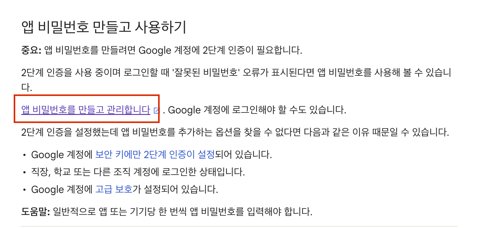

# 알림 전송 서버


## 1. 디렉토리 구조

---

핵사고날 아키텍처의 Port And Adapter 패턴을 이용하여 구성


```tree
.
nss
├── NotificationSenderServerApplication.java
├── adapter
│   ├── in
│   │   └── queue-listener
│   │       ├── SendEmailConsumer.java
│   │       ├── SendPushConsumer.java
│   │       └── SendSMSConsumer.java
│   └── out
│       ├── infra
│       │   └── mail
│       │       ├── SMTPTransporter.java
│       │       ├── SMTPTransporterException.java
│       │       └── SendMailPort.java
│       └── producer
│           ├── FrontNotificationProducer.java
│           ├── SendFrontNotificationByFail.java
│           └── SendFrontNotificationBySuccess.java
├── application
│   └── event
│       ├── EventPublisher.java
│       ├── SendEmailEvent.java
│       ├── SendPushEvent.java
│       ├── SendResultEvent.java
│       ├── SendSMSEvent.java
│       └── handler
│           ├── SendEmailEventHandler.java
│           ├── SendPushEventHandler.java
│           ├── SendResultEventHandler.java
│           └── SendSMSEventHandler.java
├── common
│   ├── PayloadConvertException.java
│   └── Serializer.java
├── config
│   ├── NotificationSenderConfig.java
│   └── RabbitMQConfig.java
├── dto
│   ├── EmailMessage.java
│   ├── MessageMapper.java
│   ├── PushMessage.java
│   ├── ResultMessage.java
│   └── SMSMessage.java
└── simulation
    ├── LatencyType.java
    ├── NotificationSender.java
    ├── ResponseType.java
    ├── ResponseTypeSelector.java
    ├── ResultType.java
    └── SendResponse.java
```


## 1. SMTP 설정

Google SMTP로 테스트
1. gmail smtp 테스트할 경우 앱 비밀번호를 설정
   1. https://support.google.com/mail/answer/185833?hl=ko



앱 비밀번호를 만들고 관리합니다 클릭


앱 이름 적고으면 비밀번호가 생성된다.

```yml
mail:
    host: smtp.gmail.com     //smtp 서버 주소
    port: 465
    username: userEmail     //이메일 설정
    password: userPassword   //비밀번호 설정(gmail 일경우 앱 비밀번호)
    properties:
      mail:
        smtp:
          ssl:
            enable: true
            trust: smtp.gmail.com     //smtp 서버 주소
            protocols: TLSv1.2
          starttls:
            enable: true
          auth: true
          connectiontimeout: 5000
          timeout: 3000
          writetimeout: 3000
```

---